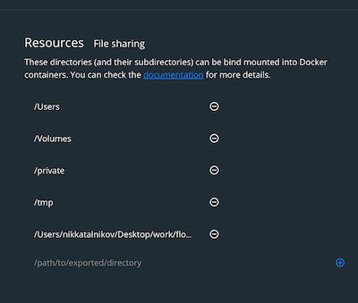

# About

This is jupyter notebook with MAPPER application against UCI ML Breast Cancer Wisconsin Diagnostics.
Extends an  with more exploratory steps and using PCA as a projecting lens for MAPPER.

A showcase part of BSc thesis about the mathematical foundation of computational topology (Institute of Applied Systems Analysis, Kyiv Polytechnic Institute, 2020).

# Env. setup instructions

1. Install Docker and Docker Compose
2. Ensure providing Docker access to the repo base directory. For example, for Mac OS:
{:height="36px" width="36px"}.
3. From repo base dir execute:

    ```shell script
    docker-compose up
    ```
    and wait until the custom Docker image with Jupyter, conda and dependencies will be built.
4. Go to Jupyter notebook:

    ```shell script
    http://127.0.0.1:8888/notebooks/breats_cancer_tda.ipynb
    ```
    using token `easy` and execute cells
5. To kill containers:

    ```shell script
    docker-compose down
    ```
   or use `Ctrl+C` if docker-compose is your current session
